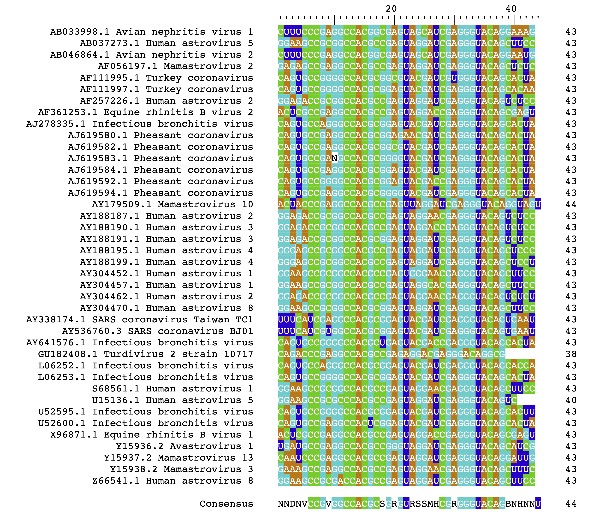
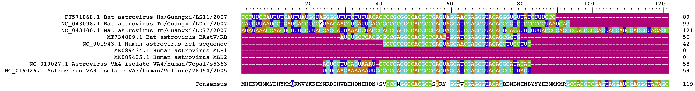

# Astrovirus s2m sequence analysis
## Introduction
This companion to “s2m sequence analysis of the Astrovirus” (published in Medium) compiles scripts used to generate the figures.

### Figure 1
There are two images in this figure. `1A` is a transmission electron microscopy image of the Human Astrovirus, which is taken directly from the figure in the Wikipedia Astrovirus page (https://en.wikipedia.org/w/index.php?title=Astrovirus&oldid=1311190801). 
`1B` is the composite image of the 3D reconstructed surface of Human Astrovirus 1 (Figure 1A from the ICTV Astrovirus website (https://ictv.global/report_9th/RNApos/Astroviridae) and the area corresponding to 5-fold T=3 icosahedral areas highlighted in green. This composite image was created by Pixelmator Pro version 3.8.

### Figure 2
This figure shows the genomic organization of Human Astrovirus taken from Figure 2 in ICTV Astrovirus website (https://en.wikipedia.org/w/index.php?title=Astrovirus&oldid=1311190801). ORFX reading frame in dark blue was added by me using Pixelmator Pro version 3.8.  

### Figure 3
Sequences of **s2m** from a family of virus known to possess **s2m** ([Family:s2m(RF00164)](https://rfam.org/family/RF00164#tabview=tab1) in Rfam database). `RF00164` is a typical fasta file;
```
>AB033998.1/6702-6744
CUUUCCCGAGGCCACGGCGAGUAGCAUCGAGGGUACAGGAAAG
>AB037273.1/2393-2435
GGAAGCCGCGGCCACGCCGAGUAGGAUCGAGGGUACAGCUUCC
>AB046864.1/2311-2353
CUUUCCCGAGGCCACGGCGAGUAGCAUCGAGGGUACAGGAAUG
>AF056197.1/2428-2470
GAGAGCCGAGGCCACGCCGAGUAGGAUCGAGGGUACAGCUCUC
```
There are several **non-viral s2m** included in `RF00164` as shown below:

1. Spodoptera exigua
2. Psylliodes chrysocephala
3. Operophtera brumata
4. Tenebrio molitor
5. Callosobruchus maculatus
6.	Leptidea sinapis
7. Brenthis ino
8. Leptidea sinapis
9. Arctia plantaginis

These **non-viral s2m** were deleted from the list of `RF00164`. 

One striking thing about the non-viral species having **s2m** sequences is that the fact that they are all insects, mainly moths.  I do not know if the conservation of the **s2m** sequence in moths carries any evolutionary significance, but I think it is most likely an alignment artifact, though since I am not a moth or evolutionary biologist, I cannot say for sure that these are functional equivalents of the **viral s2m**.  

At any rate, deleting the non-viral s2m sequence from entries of `RF00164` turned out to be pretty simple. They are, for some reason, gathered at the bottom of `RF00164`, precisely from the line 85 to the line 122 (end of the line).  All it takes is to delete line 85 to line 22 in `RF00164`, and this can be easily done with your favorite text editor or using Unix `sed/gsed (GNU sed)` command in the terminal as follows:
```
wc -l RF00164.txt
122 RF00164.txt

cat /Volumes/MySlateDrive/Astrovirus/RF00164.txt | gsed "85,$ d" > RF00164.mini

wc -l RF00164.mini
84	RF00164.mini
```
**38 non-viral s2m sequences** were removed from the original RF00164. As a result,  I now have a truncated list of s2m sequences, remaining only **viral s2m sequences**. 

Next, I need to modify the sequence label in `RF00164` to something more human readable.
Prior to modification, the sequence label looks as follows:
```
seqkit seq -n RF00164.mini

AF257226.1/425-467
AY338174.1/29515-29557
Y15938.2/2354-2396
L06253.1/392-434
AB046864.1/2311-2353
AB037273.1/2393-2435
AY188195.1/190-232
AY188187.1/197-239
AJ619582.1/83-125
AF111995.1/1596-1638
S68561.1/2636-2678
AY536760.3/1545-1587
AB033998.1/6702-6744
AJ619592.1/83-125
AJ619584.1/73-115
AF111997.1/1443-1485
U52595.1/1520-1562
AY188199.1/190-232
AJ619594.1/83-125
AY641576.1/27283-27325
AY188190.1/197-239
AY179509.1/6505-6548
Y15937.2/6358-6400
L06252.1/368-410
Z66541.1/2326-2368
AF361253.1/8721-8763
AY304457.1/197-239
AJ619583.1/83-125
U52600.1/1419-1461
AY304452.1/197-239
AY188191.1/197-239
AY304470.1/197-239
AY304462.1/197-239
AJ278335.1/370-412
U15136.1/2344-2382
Y15936.2/6871-6913
AF056197.1/2428-2470
AJ619580.1/109-151
URS000080DEE1_32630/2-47
Z25771.1/6710-6752 Human astrovirus type 1 genes for capsid protein and nonstructural protein
GU182408.1/7552-7594 Turdivirus 2 strain 10717, complete genome
X96871.1/8728-8770 Equine Rhinovirus type 2 genomic sequence
```
**NCBI accession numbers** are followed by **/** and then the position of the **s2m sequences** in the viral genomic sequences. Noice a last few entries have sequence descriptions following accession numbers and s2m sequence positions, and these will be removed by using ‘i’ flag in `seqkit` `seq` command as follows:
```
seqkit seq -n -i RF00164.mini |tail
AY304462.1/197-239
AJ278335.1/370-412
U15136.1/2344-2382
Y15936.2/6871-6913
AF056197.1/2428-2470
AJ619580.1/109-151
URS000080DEE1_32630/2-47
Z25771.1/6710-6752
GU182408.1/7552-7594
X96871.1/8728-8770
```
The next step is to get a list of virus names from the NCBI database using the provided in `RF00164.mini` but first, accession numbers have to be extracted from `RF00164.mini`. A following line of code is used to obtain the **<ins>unique<ins>** accession numbers:
```
gsed --regexp-extended 's/\/\w.+//g' RF00164.mini | uniq > s2m_accession.txt

bat s2m_accession.txt

AF257226.1
AY338174.1
Y15938.2
L06253.1
AB046864.1
AB037273.1
AY188195.1
AY188187.1
AJ619582.1
AF111995.1
S68561.1
AY536760.3
AB033998.1
AJ619592.1
AJ619584.1
AF111997.1
U52595.1
AY188199.1
AJ619594.1
AY641576.1
AY188190.1
AY179509.1
Y15937.2
L06252.1
Z66541.1
AF361253.1
AY304457.1
AJ619583.1
U52600.1
AY304452.1
AY188191.1
AY304470.1
AY304462.1
AJ278335.1
U15136.1
Y15936.2
AF056197.1
AJ619580.1
URS000080DEE1_32630
Z25771.1
GU182408.1
X96871.1
```
The above line of code ensures <ins>no duplicated accession numbers</ins> are included in the `s2m_accession`.  

Now,I can extract the accurate virus names from the NCBI database using the list of accession numbers above.  This is done by using a NCBI’s command line tools;  both `datasets and dataformat` are NCBI command line tools downloaded from https://www.ncbi.nlm.nih.gov/datasets/docs/v2/download-and-install/ and https://www.ncbi.nlm.nih.gov/datasets/docs/v2/command-line-tools/using-dataformat/ 

Then, a following code extracts the accurate virus name corresponding the accession numbers:
```
datasets summary virus genome accession --inputfile Desktop/s2m_accession.txt --as-json-lines |dataformat tsv virus-genome --fields accession,virus-name > s2m_virus.tsv
```
The content of the `s2m_virus.tsv` is shown below:
```
 ────────────┬─────────────────────────────╮
│ Accession  │ Virus Name                  │
├────────────┼─────────────────────────────┤
│ Z66541.1   │ Human astrovirus 8          │
│ Z25771.1   │ Human astrovirus 1          │
│ Y15938.2   │ Mamastrovirus 3             │
│ Y15937.2   │ Mamastrovirus 13            │
│ Y15936.2   │ Avastrovirus 1              │
│ X96871.1   │ Equine rhinitis B virus 1   │
│ U52600.1   │ Infectious bronchitis virus │
│ U52595.1   │ Infectious bronchitis virus │
│ U15136.1   │ Human astrovirus 5          │
│ S68561.1   │ Human astrovirus 1          │
│ L06253.1   │ Infectious bronchitis virus │
│ L06252.1   │ Infectious bronchitis virus │
│ GU182408.1 │ Oscivirus A1                │
│ AY641576.1 │ Infectious bronchitis virus │
│ AY536760.3 │ SARS coronavirus BJ01       │
│ AY338174.1 │ SARS coronavirus Taiwan TC1 │
│ AY304470.1 │ Human astrovirus 8          │
│ AY304462.1 │ Human astrovirus 2          │
│ AY304457.1 │ Human astrovirus 1          │
│ AY304452.1 │ Human astrovirus 1          │
│ AY188199.1 │ Human astrovirus            │
│ AY188195.1 │ Human astrovirus            │
│ AY188191.1 │ Human astrovirus            │
│ AY188190.1 │ Human astrovirus            │
│ AY188187.1 │ Human astrovirus            │
│ AY179509.1 │ Mamastrovirus 10            │
│ AJ619594.1 │ Pheasant coronavirus        │
│ AJ619592.1 │ Pheasant coronavirus        │
│ AJ619584.1 │ Pheasant coronavirus        │
│ AJ619583.1 │ Pheasant coronavirus        │
│ AJ619582.1 │ Pheasant coronavirus        │
│ AJ619580.1 │ Pheasant coronavirus        │
│ AJ278335.1 │ Infectious bronchitis virus │
│ AF361253.1 │ Equine rhinitis B virus 2   │
│ AF257226.1 │ Human astrovirus 2          │
│ AF111997.1 │ Turkey coronavirus          │
│ AF111995.1 │ Turkey coronavirus          │
│ AF056197.1 │ Mamastrovirus 2             │
│ AB046864.1 │ Avian nephritis virus 2     │
│ AB037273.1 │ Human astrovirus 5          │
│ AB033998.1 │ Avian nephritis virus 1     │
╰────────────┴─────────────────────────────╯
```

<sup>*</sup>supURS000080DEE1_32630 was an artificially created s2m sequence and thus not registered in NCBI virus database.

There are a few issues that are immediately apparent, for instance, the same name virus with different accession numbers, and inconsistent/incomplete virus notations (variants/serotypes). These issues must be dealt with before going any further.  Since CLI is not the easiest place for manipulating `tsv` files, I used Apple’s `Numbers` (or your favorite spreadsheet editor) to make some changes in the `s2m_virus.tsv` as follows:


As you can see, I added correct clade numeration for Human Astrovirus.  Also, I added variant notations to the `Pheasant coronavirus` (which I later decided to remove!!).

Next, a file, `temp.txt` having genomic location of `s2m` corresponding the `accession` in the identical order was created as follows:
```
seqkit seq -n s2m.mini|gsed --regexp-extended "s/(^[^ ].+)(\/.+)/\2/" >temp.txt
or
seqkit seq -n s2m.mini|seqkit seq -n -i  --id-regexp  "[A-Z]\w+..(\/\w.+)" >temp.txt
```
Output of the above command, `temp.txt` was cut and pasted into above `s2m_virus.tsv` to replace the `accession` column by again using Apple’s `Number` and saved as `mapping.tsv`. As noticed, three of s2m position also contains additional virus sequencing information (in **<u>bold+underline</u>**) which were removed. The below shows the content of `temp.txt`;
<pre>
/6702-6744
/2393-2435
/2311-2353
/2428-2470
/1596-1638
/1443-1485
/425-467
/8721-8763
/370-412
/109-151
/83-125
/83-125
/73-115
/83-125
/83-125
/6505-6548
/197-239
/197-239
/197-239
/190-232
/190-232
/197-239
/197-239
/197-239
/197-239
/29515-29557
/1545-1587
/27283-27325
/7552-7594 <b><u>Turdivirus 2 strain 10717, complete genome</u></b>
/368-410
/392-434
/2636-2678
/2344-2382
/1520-1562
/1419-1461
/8728-8770 <b><u>Equine Rhinovirus type 2 genomic sequence</u></b>
/6871-6913
/6358-6400
/2354-2396
/6710-6752 <b><u>Human astrovirus type 1 genes for capsid protein and nonstructural protein</u></b>
/2326-2368
</pre>
Moreover, <b><u>ref column</u></b> and <b><u>replacement column</u></b> must be `tab` separated. This can be easily done by saving `mapping` as `tsv` in `Numbers`

The resulting `mapping.tsv` looks as follows:
```
/6702-6744	Avian nephritis virus 1	
/2393-2435	Human astrovirus 5	
/2311-2353	Avian nephritis virus 2	
/2428-2470	Mamastrovirus 2	
/1596-1638	 Turkey coronavirus	
/1443-1485	 Turkey coronavirus	
/425-467	Human astrovirus 2_1	
/8721-8763	Equine rhinitis B virus 2	
/370-412	 Infectious bronchitis virus	
/109-151	 Pheasant coronavirus	
/83-125	 Pheasant coronavirus	
/83-125	 Pheasant coronavirus	
/73-115	 Pheasant coronavirus	
/83-125	 Pheasant coronavirus	
/83-125	 Pheasant coronavirus	
/6505-6548	Mamastrovirus 10	
/197-239	Human astrovirus 2_2	
/197-239	Human astrovirus 3_1	
/197-239	Human astrovirus 3_2	
/190-232	Human astrovirus 4_1	
/190-232	Human astrovirus 4_2	
/197-239	Human astrovirus 1_1	
/197-239	Human astrovirus 1_2	
/197-239	Human astrovirus 2_3	
/197-239	Human astrovirus 8	
/29515-29557	SARS coronavirus Taiwan TC1	
/1545-1587	SARS coronavirus BJ01	
/27283-27325	 Infectious bronchitis virus	
/7552-7594	Turdivirus 2 strain
/368-410	 Infectious bronchitis virus	
/392-434	 Infectious bronchitis virus	
/2636-2678	Human astrovirus 1_3	
/2344-2382	Human astrovirus 5	
/1520-1562	 Infectious bronchitis virus	
/1419-1461	 Infectious bronchitis virus	
/8728-8770	Equine rhinitis B virus 1
/6871-6913	Avastrovirus 1	
/6358-6400	Mamastrovirus 13	
/2354-2396	Mamastrovirus 3	
/6710-6752	Human astrovirus 1
/2326-2368	Human astrovirus 8	
```
Although this approach of creating and using `mapping.tsv` may appear cumbersome, I found this approach was the easiest since it could take advantage of  `seqkit replace` command which replaces the pattern (e.g.`/425-467`) in the sequence ID(e.g.`AF257226.1/425-467`) of the input fasta file with a column containing a replacement pattern (e.g.`Human astrovirus 2` ) in a supplied tsv file with matching patterns ((e.g.`/425-467`)) in the reference column. A following single line of code will pull the magic:
```
seqkit replace -k `mapping.tsv`  -p "(\/\w.+)" -r " {kv}" input.fa > output.fa
```
 A snippet of  `output.fa` looks as follows:
```
>AB033998.1 Avian nephritis virus 1
CUUUCCCGAGGCCACGGCGAGUAGCAUCGAGGGUACAGGAAAG
>AB037273.1 Human astrovirus 5
GGAAGCCGCGGCCACGCCGAGUAGGAUCGAGGGUACAGCUUCC
>AB046864.1 Avian nephritis virus 2
CUUUCCCGAGGCCACGGCGAGUAGCAUCGAGGGUACAGGAAUG
>AF056197.1 Mamastrovirus 2
GAGAGCCGAGGCCACGCCGAGUAGGAUCGAGGGUACAGCUCUC
>AF111995.1  Turkey coronavirus
CAGUGCCGGGGCCACGCGGCGUACGAUCGUGGGUACAGCACUA
```
The next step is to import `output.fa` into `R`, and this is accomplished by a bioconductor R package, `Biostrings` as follows;
```
Library(Biostrings)
s2m<-readRNAStringSet(filepath = "/Volumes/MySlateDrive/Astrovirus/output.mod.fa", format = "fasta", use.names = T)
```
This step creates a `RNAstringset` object, `s2m` which looks as follows:


I made a couple of modifications to `s2m`; 
1. Accession, `Z25771.1` was deleted because this was the sequence for **"Human astrovirus type 1 genes for capsid protein and nonstructural protein”** but not virus. This was easily accomplished by `s2m.mini<-s2m[-40]`
2. I found two sequence with accessions, `U15136.1` (row 33) and `X96871.1` (row 36) with shorter s2m length (38 and 39 respectively) that appear to be misaligned, off by 1 bp. I can almost guarantee that this 1bp misalignment by a Rfam sequence alignment algorithm.  Sometimes, automated curation is not perfect. Correction was made by following lines of code:
   ```
   U15136.1<-DNAString("GGAAGCCGCGCCCACGCCGAGUAGGAUCGAGGGUACAGUC")
   s2m.mini[33]<-as(U15136.1, "RNAStringSet")
   X96871.1<-DNAString("ACTCGCCGAGGCCACGCCGAGTAGGACCGAGGGTACAGCGAGT")
   s2m.mini[36]<-as(X96871.1, "RNAStringSet")
   ```
A resulting `s2m.mini` looks as follows;

Clearly, sequence labels in the `s2m.mini` is ordered by `accession` but this probably is less meaningless than ordered by `virus name`.  Perhaps, it makes more sense to arrange the label according to the virus name alphabetically:
```
names(s2m.mini) %>% str_replace(pattern = "(^\\S+.)(\\S.+)", replacement = "\\2") %>% str_order() >myorder
BrowseSeqs(s2m.mini[myorder])
```
A result of this script is following;


### Figure 4
This figure depicts sections of genomic sequence (converted to transcripts) among bat Astrovirus and emerging strains of human Astrovirus that correspond to the defined `s2m` sequence from reference human Astrovirus (Human Astrovirus 1). These bat Astrovirus strains were from the early reports of the zoonotic Astrovirus in the `NCBI Virus` database. 

To Construct `Figure 4`, I did the following steps;
1. The first step to download the viral genomic sequence from the `NCBI Virus` database (https://www.ncbi.nlm.nih.gov/labs/virus/vssi/#/).
2. Downloaded sequence files from NCBI are named as “sequence_x.fasta”.  This is okay if these files are processed immediately after download, but people like me who download a bunch of these sequence files and process them later get annoyed by this naming scheme of NCBI. It may be okay for several files, but if you are talking about dozens	of files downloaded, you want to know which file corresponds to what.  So I came up with a short line of code that takes `accession ID` and replaces `sequence_x` with the `accession ID` of the corresponding sequence as follows:
   ```
    # serch dowloaded fasta sequence in a local drive (TEMP)  and create a list of full path of such files 
    fd . -tf -e fasta /Volumes/Temp -X eza -lr -s modified -1 > list.txt
    INPUT_FILE="list.txt"
    # content of list file will be converted to a ZSH array
    files=("${(f)$(<"$INPUT_FILES")}")
    #this loop converts names of fasta files downladed from NCBI to its accession ID 
    for filename in "${files[@]}"; do \
    head -n 1  $filename | gsed --regexp-extended 's/^>([^ ]+).*/\1/' | xarg -I{} mv "$filename" "/Volumes/Temp/{}.fa"
    done
    ```
There are probably better ways of accomplishing this but this was sufficient for my purposes.  Then, these renames fasta files will be imported to `R` as described previously. 

The next step is to align these sequences and visualize the alignment corresponding `s2m` region by using `DECIPER` as follows;
```
AlignSeqs(s2m.comb, processor=18)->s2m.comb.alg
#below shows a location of s2m in the aligned sequence.  
subseq(s2m.comb.alg, start = 9920, end = 10040) %>% BrowseSeqs()
```
This creates an image used as `Figure 4` in the manuscript. 



